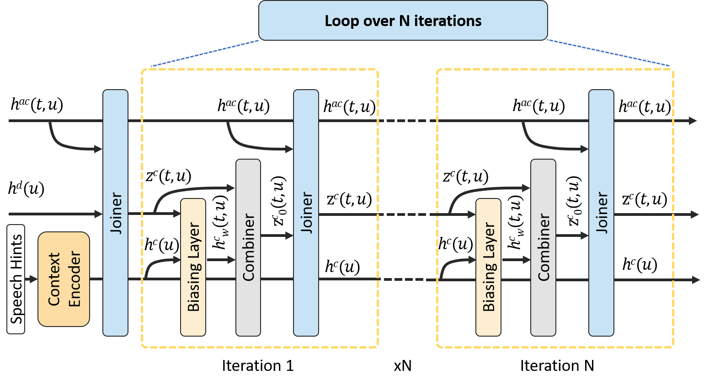

# Looped Transformer Interpretation of a Self-Consistent Conformer Transducer

This repository accompanies the paper:

**Self-consistent context aware conformer transducer for speech recognition**  
📄 arXiv: https://arxiv.org/abs/2402.06592

The work introduces a **self-iterative, self-consistent architecture** for conformer-based
transducer models. The resulting iterative computation resembles a **looped transformer**, 
in which the transducer joiner block is repeatedly applied to achieve context-aware refinement in speech recognition.

## Overview

Recent research has explored **looped transformer architectures**, where a transformer
(or transformer-like block) is applied repeatedly with shared parameters to refine internal
representations through iteration.

In our paper, we propose a **self-consistent conformer transducer** in which contextual
representations are refined via iterative updates until convergence. This mechanism is
conceptually related to a **looped transformer**, where the same model block is reused
across multiple internal steps.

---

## Key Concepts

- **Looped Transformer**  
  An architecture in which a transformer (or conformer) block is applied iteratively,
  enabling recursive refinement of representations.

- **Self-consistent Iterations**  
  Self-consistent iterations are an iterative algorithm used to find stable solutions in complex systems, 
  particularly in quantum physics for electronic structure, where an output (like electron density) 
  from one step becomes the input for the next until the solution stops changing 
  significantly (achieves "self-consistency").

- **Context-aware Conformer Transducer**  
  A conformer-based transducer enhanced with user-provided context propagation, enabling improved 
  speech recognition performance for rare words.

---

## Context Joiner as a Looped Joiner

This figure shows the unrolled representation of the Context Joiner from Fig. 2 of the paper. 

  

---

First, we take $h^{ac}(t, u)$ and $h^d(u)$ as inputs
and compute the joiner output $z^c(t, u)$. Then we compute the biasing layer output $h^c_w(t, u)$ and
combiner output $z^c_0(t, u)$ and feed it to the joiner again. We repeat this process until the difference
between the joiner outputs from consecutive iterations $n$ and $n - 1$ falls below a small threshold.

A similar idea has been applied to the repeated application of transformer layers in LLMs [1, 2].

## Relation to Looped Transformers

While our paper focuses on speech recognition and conformer transducers, the proposed
self-iteration mechanism aligns with the broader idea of **looped transformer architectures**:

- Shared parameters across iterations  
- Repeated application of joiner block
- Improved contextual consistency through iterative refinement 

Thus, the model can be viewed as a **looped transformer-like architecture specialized
for conformer transduction**.

---

## Paper

If you use or reference this work, please cite:

@article{selfconsistentconformer2024,
title={Self-consistent context aware conformer transducer for speech recognition},
author={...},
journal={arXiv preprint arXiv:2402.06592},
year={2024}
}

## References

**[1]** Rui-Jie Zhu and Zixuan Wang and Kai Hua and Tianyu Zhang and Ziniu Li and Haoran Que and Boyi Wei and Zixin Wen and Fan Yin and He Xing and Lu Li and Jiajun Shi and Kaijing Ma and Shanda Li and Taylor Kergan and Andrew Smith and Xingwei Qu and Mude Hui and Bohong Wu and Qiyang Min and Hongzhi Huang and Xun Zhou and Wei Ye and Jiaheng Liu and Jian Yang and Yunfeng Shi and Chenghua Lin and Enduo Zhao and Tianle Cai and Ge Zhang and Wenhao Huang and Yoshua Bengio and Jason Eshraghian.
"Scaling Latent Reasoning via Looped Language Models", 2025, arXiv, https://arxiv.org/abs/2510.25741

**[2]** Harsh Kohli and Srinivasan Parthasarathy and Huan Sun and Yuekun Yao. "Loop, Think, & Generalize: Implicit Reasoning in Recurrent-Depth Transformers", 2026, arXiv, https://arxiv.org/abs/2604.07822

